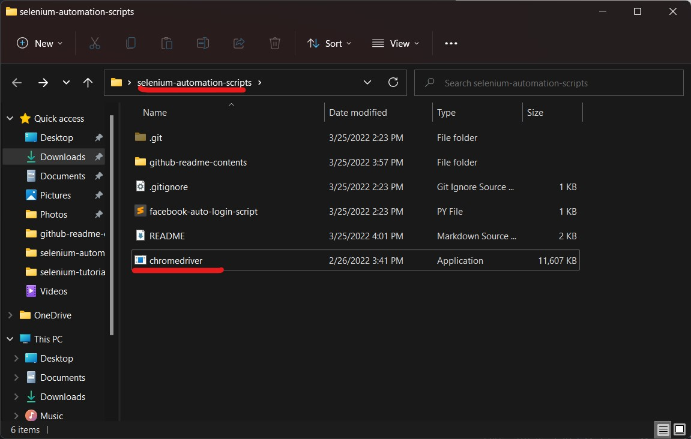

# Selenium Automation Scripts

## Introduction

Selenium is an open-source tool that automates web browsers. It provides a single interface that lets you write test scripts in programming languages like Ruby, Java, NodeJS, PHP, Perl, Python, and C#.

This repository contains a collation of python scripts that are built top on the Selenium framework. Selenium supports all types of browsers; however, we use only Google Chrome as a testing browser.


## Setting up Selenium

Setting up selenium is very easy. We are using Google Chrome driver as a browser instance to run automated scripts.


**Step 01:** Install Selenium

```
  pip install selenium
```

**Step 02:** Setup Chrome Driver

There are many scripts are in this repository, we are using Google Chrome version 99.0 for the time this repository is written.  

Later, the Google Chrome will be updated, therefore, we always need to download the correct chrome driver that matches with the installed Chrome browser on your computer.

#### 01. Checking Chrome version


#### 02. Chrome version


This Chrome version is 99.0, therefore we need to download the correct chrome driver for it, otherwise, the script won't work.

Download Chrome Driver: https://chromedriver.chromium.org/downloads


**Note:** We have to download the chrome driver that works for your OS.


**Step 03:** Add chrome driver to the script

To add this chrome driver to the script, just extract the zip and copy the "chromedriver.exe" file and then, paste it in this project folder.



After this, we can execute the automation scripts. If you want to paste the "chromedriver.exe" to a different location, then you have to edit the path in code.


## Execution & Running

- Running a script

```
python script-name.py
```

- Example

```
python facebook-auto-login-script.py
```

# CONTACT

### Website: 

[](http://www.gunarakulan.info)

### Social Media:

[](https://www.linkedin.com/in/gunarakulangunaretnam)
[](https://www.facebook.com/gunarakulangunaretnam)
[](https://wa.me/94740001141?text=WhatsApp%3A%20%2B9740001141)
[](https://www.instagram.com/gunarakulangunaretnam)
[](https://x.com/gunarakulangr)
[](https://www.kaggle.com/gunarakulangr)
[](https://www.tiktok.com/@gunarakulangunaretnam)
[](https://www.youtube.com/channel/UCjMOdgHFAjAdBKiqV8y2Tww)
